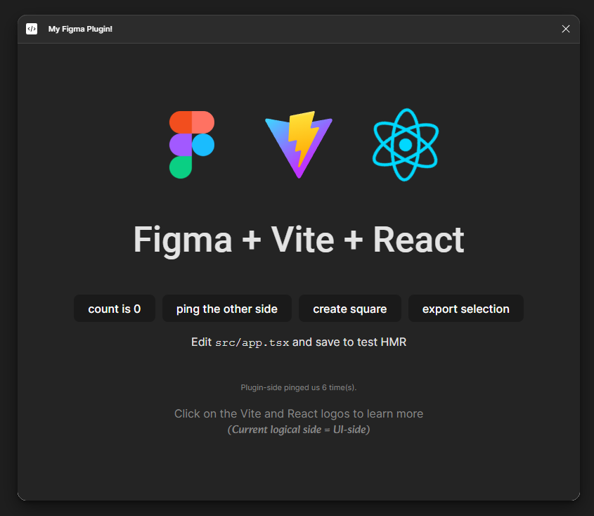

# React Icons Exporter

Figma plugin to detect SVG icons and export them as raw SVG files or React components (`.tsx` / `.jsx`) inside a `.zip` package.



## Quick Overview

This plugin helps you:

- Detect icon candidates from selection or entire page.
- Review detected icons before export.
- Export to `svg`, `typescript`, or `javascript`.
- Configure color handling, naming convention, and file structure.

Flow:

1. Choose detection mode (`selection` or `page-analysis`).
2. Review and select icons.
3. Configure output options.
4. Export and download a `.zip`.

## Features

- Detection modes:
  - `selection`
  - `page-analysis`
- Output formats:
  - `svg`
  - `typescript` (React `.tsx` components)
  - `javascript` (React `.jsx` components)
- Naming conventions:
  - `PascalCase`
  - `camelCase`
  - `snake_case`
  - `kebab-case`
- Color modes:
  - `preserve`
  - `currentColor`
- File structure:
  - `individual` (one file per icon)
  - `single-file` (sprite/barrel-based output)

## Tech Stack

- React 19 + TypeScript
- Vite 5
- Zustand
- monorepo-networker
- JSZip

## Project Structure

```text
src/
  common/   # Shared types and UI/plugin message contracts
  plugin/   # Figma runtime logic (icon detection and export data)
  ui/       # React UI for workflow and export config
figma.manifest.ts
vite.config.plugin.ts
vite.config.ui.ts
```

## Requirements

- Node.js `>=20.11.0`
- npm or pnpm
- Figma Desktop (recommended for plugin development)

## Installation

```bash
npm install
```

Or:

```bash
pnpm install
```

## Development

Run plugin watch mode (UI + plugin bundle):

```bash
npm run dev
```

Run UI only in browser (without Figma context):

```bash
npm run dev:ui-only
```

## Build

```bash
npm run build
```

Build output is generated in `dist/`:

- `dist/manifest.json`
- `dist/plugin.js`
- `dist/index.html`

## Load in Figma

1. Open Figma.
2. Go to `Plugins > Development > Import plugin from manifest...`
3. Select `dist/manifest.json`.

## Available Scripts

- `npm run dev` - watch mode for plugin + UI
- `npm run dev:ui-only` - local UI in browser
- `npm run build` - full production build
- `npm run lint` - run ESLint
- `npm run format` - run Prettier

## Output Behavior Notes

- Detection uses vector/name/size heuristics and currently caps response to 200 icons per run.
- `typescript` export can include typed props (`React.SVGProps<SVGSVGElement>`).
- In `single-file` mode:
  - `svg` produces `sprite.svg`
  - `typescript` adds `index.ts` barrel exports
  - `javascript` adds `index.js` barrel exports

## Quick Troubleshooting

- No icons in `selection`: ensure there is an active visible selection.
- No icons in `page-analysis`: ensure nodes are exportable and compact-sized.
- UI works but Figma API fails: this is expected in `dev:ui-only` mode.

## License

This repository includes a Creative Commons BY-SA 4.0 license.
See `LICENSE` for full terms.
